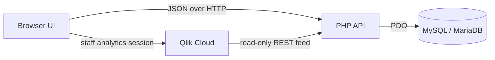

# PaddlePointer

PaddlePointer runs MTC pickleball events. Staff schedule Open Play, score matches, manage players, and follow courts and results. Visitors can score their own matches; player accounts can see their match summaries. Saved events and scores live in MySQL or MariaDB.

**Qlik is used only for staff analytics.** It reads saved results and calculates analytics data. PaddlePointer draws the charts and tables; scoring and the live board work without Qlik.

## Run locally

These steps use PowerShell. You need Git, PHP 8.1 or newer with PDO MySQL, and a running MySQL or MariaDB server. No npm or Composer install is needed.

1. Clone the repository and copy the configuration template.

   ```powershell
   git clone git@github.com:notlath/mtc-paddlepoint.git
   cd mtc-paddlepoint
   Copy-Item .env.example .env
   ```

2. Edit `.env` for your database. With blank `PP_DB_*` values, the app uses `127.0.0.1:3306`, database `ac_pickle_score_new_app`, user `root`, and an empty password. The database user must be able to create the database and its tables on first run. Alternatively, create the database yourself and grant the user permission to create and alter its tables. Add `PP_DB_PORT=<port>` to `.env` if MySQL does not use port 3306; this setting is supported by the code but absent from the template. Qlik variables can remain empty for basic scoring.

3. Start the PHP server from the repository root.

   ```powershell
   php -S 127.0.0.1:8000 -t .
   ```

4. Open <http://127.0.0.1:8000/>. In a second terminal, check the API and database:

   ```powershell
   Invoke-RestMethod http://127.0.0.1:8000/api/health.php
   ```

   A working response contains `ok: true` and the database name. This request also applies pending schema migrations. If the database does not exist, the app creates it when the configured user has permission.

5. Sign in. The first migration seeds the Super Admin account `superadmin_ac`. Its password is stored as a hash in the repository, but the plaintext initial password and a provisioning command are **not documented**. Obtain the credential securely from the maintainer, or have a database administrator set a local password hash. Change a shared initial password in Profile after signing in.

Keep this development server bound to `127.0.0.1`: its document root contains `.env`. `serve-local.ps1` serves static files only and cannot run the PHP API. See [Security](#security) before exposing the app to other devices or deploying it.

## What runs where

| Part | Implementation | Responsibility |
| --- | --- | --- |
| Browser | Plain HTML, CSS, and JavaScript in `index.html`, `app.js`, and small modules | Screens, scoring controls, schedule generation, and live updates. No frontend framework or build step. |
| API | PHP 8.1+ scripts in `api/` | JSON requests, validation, access checks, and database writes. PHP uses PDO MySQL; Qlik calls also require cURL. |
| Database | MySQL or MariaDB | Source of truth for accounts, sessions, players, events, and finished matches. Schema is managed by `api/schema.php`. |
| Staff analytics | Qlik Cloud, `@qlik/api@2.16.0`, and vendored D3 7.9.0 | Qlik supplies calculations and selection state; PaddlePointer renders native charts, tables, and filters. |
| Tests | Node's built-in test runner and standalone PHP scripts | Browser-module checks and API/database checks. |



The browser calls relative `api/*.php` URLs, so frontend files and PHP endpoints must be served under the same URL prefix. `app.js` coordinates the UI; `rally-engine.js` handles scoring rules, `open-play-scheduler.js` creates schedules, and `shared-store.js` coordinates refreshed data. The browser also keeps some session, setup, and active-match state in local storage. The PHP entry scripts use handlers in `games.php`, `tournaments.php`, `players.php`, and `accounts.php`. `api/access_policy.php` defines permissions, and `api/db.php` opens the database and applies migrations.

### Repository map

```text
index.html, app.js, styles.css        Browser entry and main UI
session.js, view-access.js           Session storage and view access
rally-engine.js                      Scoring rules
open-play-scheduler.js               Open Play schedules
live-board.js, shared-store.js       Live board and shared browser data
qlik-mashup.js, qlik-mashup.css       Staff analytics UI
vendor/                              D3 bundle
api/                                 PHP endpoints and shared handlers
api/qlik/                            Analytics feed, token, and reload code
database/                            Destructive clean-install SQL
tests/                               Node tests and PHP database tests
docs/adr/                             Architecture decisions
```

## Configuration reference

`api/config.php` reads the root `.env` file. A process environment variable takes precedence over the same name in `.env`. Empty values use the database defaults below; Qlik features need their corresponding values. `.env` is ignored by Git, but must also be blocked from HTTP access.

| Variable | Required for | Purpose / default |
| --- | --- | --- |
| `PP_DB_HOST` | Database, if different | Host; `127.0.0.1` by default. |
| `PP_DB_PORT` | Database, if different | Port; `3306` by default. Missing from `.env.example`. |
| `PP_DB_NAME` | Database, if different | Name; `ac_pickle_score_new_app` by default. |
| `PP_DB_USER` | Database, if different | User; `root` by default for local use. Use a restricted user in production. |
| `PP_DB_PASS` | Database, if needed | Password; empty by default. |
| `PP_TEST_DB_HOST` | PHP tests, if different | Disposable test server host; `127.0.0.1` by default. |
| `PP_TEST_DB_PORT` | PHP tests | Disposable test server port; test code defaults to `3307`, but `.env.example` sets `3306`. |
| `PP_TEST_DB_USER` | PHP tests, if different | Test user; `root` by default. Needs database create/drop rights. |
| `PP_TEST_DB_PASS` | PHP tests, if needed | Test password; empty by default. |
| `ANALYTICS_KEY` | Qlik REST feed | Shared key supplied by Qlik in `X-Analytics-Key`; feed requests fail when unset. |
| `QLIK_M2M_CLIENT_ID` | Staff analytics | Qlik OAuth M2M client ID. |
| `QLIK_M2M_CLIENT_SECRET` | Staff analytics | Qlik OAuth M2M client secret. |
| `QLIK_EVENT_VIEWER_SUBJECT` | Staff analytics | Qlik user subject for staff impersonation. |
| `QLIK_RELOAD_TRIGGER_URL` | Optional reload trigger | URL of the Qlik triggered automation. |
| `QLIK_RELOAD_TRIGGER_TOKEN` | Optional reload trigger | Execution token for that automation. Both trigger values are needed to enable it. |

The Qlik tenant, app ID, and public OAuth client ID are currently in `api/config.php`, `app.js`, and `qlik-mashup.js`. Using another Qlik tenant or app requires changing those settings and configuring Qlik outside this repository. The Qlik reload schedule and browser-origin permissions are also external; they cannot be verified here.

## Data and migrations

`api/db.php` calls `migrate()` when it opens a PDO connection. `api/schema.php` runs migrations in order and records them in `schema_migrations`; there is no separate migration or rollback CLI. The first database request after a deploy runs any pending migrations. Back up production data before deploying schema changes. Append migrations rather than changing ones already applied, because MySQL DDL may not roll back after a failure.

The main records are:

| Record | What it holds |
| --- | --- |
| `tournaments`, `tournament_matches` | Events, schedules, courts, and match status. |
| `games`, `game_players` | Saved scores, match detail, and player participation. |
| `players` | Persistent player identities and skill levels, separate from login accounts. |
| `users`, `user_sessions`, `rate_limits` | Accounts, session hashes, and request limits. |
| `app_settings` | The current event ID, initially `open_play`. |

A Super Admin starts a new event without deleting past results. Players can join a roster without an account; visitor match names do not create player records. Staff can rename or merge players, and set their skill levels.

`database/cpanel-clean-install.sql` **drops app tables and all their data**. Use it only for an intentional clean reset of an isolated app database. The next database request rebuilds the schema and seeded account. It is not a routine migration step.

## Sign-in and permissions

| Role | Sign-in | Main access |
| --- | --- | --- |
| Super Admin | Username and password | Accounts, events, schedules, corrections, scoring, and analytics. |
| Admin | Username and password | Current-event matches, players, live views, and analytics. |
| Player | Username, without password | Own match summaries. |
| Visitor | Email, without password | Own matches, history, and leaderboard. Email ownership is not verified in the current implementation. |

`POST /api/auth.php?action=login` signs in staff and players; `visitor-login` handles visitors. The API returns an opaque token, and the browser sends it in the `X-Session-Token` header. The database stores a SHA-256 hash of the token. Staff sessions last 12 hours and can extend while active; player and visitor sessions last 30 days. Signing out removes the server session. Browser navigation follows the returned permissions, but PHP endpoints enforce permissions independently through `api/access_policy.php`.

Visitor email verification is described in [ADR 0006](docs/adr/0006-visitors-verify-email-and-become-leads.md) as a **parked proposal**, not a shipped feature.

## API reference

API paths are relative to `api/`. Read endpoints use `GET`; writes generally accept JSON through `POST`. Responses use an `ok` boolean and, on failure, an `error` message with an HTTP error status. Most authenticated requests use `X-Session-Token`. There is no generated OpenAPI specification; each endpoint file and its matching test show exact request fields and edge cases.

| Group | Main endpoints |
| --- | --- |
| Health and accounts | `health.php`, `auth.php?action=me`, `auth.php?action=login`, `auth.php?action=visitor-login`, and account actions in `auth.php`. |
| Scoring and results | `save-game.php`, `get-game.php`, `get-history.php`, `get-leaderboard.php`. |
| Events | `get-tournament.php`, `save-tournament.php`, `save-tournament-match.php`, `start-event.php`, plus correction, reset, and deletion endpoints. |
| Players | `get-players.php`, `rename-player.php`, `set-player-skill.php`, `merge-players.php`. |
| Qlik feed | `qlik/get-events.php`, `qlik/get-matches.php`, `qlik/get-leaderboard-results.php`, `qlik/get-leaderboard-players.php`. Read-only; requires `X-Analytics-Key`. |
| Staff analytics token | `qlik/get-embed-token.php`. Requires a staff application session. |

Qlik loads event and match records, plus finished non-visitor results, through the read-only feed and keeps an analytics copy. That includes eligible matches outside an event. PaddlePointer remains the source of truth. A staff-only token endpoint exchanges server-held OAuth credentials for a short-lived Qlik access token; the browser then requests Qlik data through `@qlik/api` and renders its own interface. The live board reads PaddlePointer data directly, so Qlik reload delay does not affect live scoring. See [ADR 0001](docs/adr/0001-qlik-pulls-rest-no-talend.md) and the current [ADR 0004](docs/adr/0004-qlik-is-a-headless-analytics-layer.md). Older documents about embedded Qlik Sheets, including `docs/qlik-sheet-design.md`, describe a superseded design.

## Develop and test

There is no package manager script, linter, formatter, type checker, or production build command in the repository. Edit the served files and refresh the browser. `index.html` includes version strings in asset URLs; update them when deployed assets need a fresh browser fetch.

Run both test suites before committing:

```powershell
.\run-tests.ps1
```

The wrapper runs `node --test` for `tests/*.test.js`, then each `php tests/*_test.php` file. Run a reported failing command on its own to see full output, for example:

```powershell
node --test tests/open-play-scheduler.test.js
php tests/schema_test.php
```

PHP tests use `tests/test_db.php`. Each test creates and drops its own `paddlepoint_test_*` database. Point `PP_TEST_DB_*` at a **disposable** MySQL/MariaDB server and give the test account create/drop rights. Check `.env` first: `.env.example` sets `PP_TEST_DB_PORT=3306`, while the harness defaults to `3307` when the variable is absent. No Node or database-server version is pinned.

## Deploy

There is no build artifact. Deploy the tracked HTML, JavaScript, CSS, assets, and PHP files under one URL prefix on a PHP-capable web server with PDO MySQL. Configure HTTPS, a database-limited production user, and the `PP_DB_*` values; call `/api/health.php` after deployment to verify connectivity and migrations. `.htaccess` contains Apache response security headers, and `database/cpanel-clean-install.sql` suggests cPanel use, but this repository has no complete deployment automation or verified hosting runbook.

If staff analytics is required, configure the Qlik app, OAuth client, user subject, REST connector key, browser origin, and reload schedule outside this repository. Triggered reloads additionally need both `QLIK_RELOAD_TRIGGER_*` values and a once-per-minute CLI job for `api/qlik/run-pending-reload.php`, as documented in that file. Without those settings, the core scoring app still runs.

### Security

Keep `.env` and credentials out of version control **and** HTTP access. The current `.htaccess` adds security headers but does not deny requests for `.env`; the PHP development server has no repository-specific deny rule either. Configure your web server to block dotfiles and private configuration/source paths, or keep secrets outside the document root. Use HTTPS in production, restrict database privileges, and change shared initial credentials. Review the API's `Access-Control-Allow-Origin: *` setting in `api/db.php` against the deployment policy. Qlik client secrets and the analytics key belong on the server, not in browser code.

## Troubleshooting

| Problem | Check |
| --- | --- |
| Health check fails | MySQL is running, PDO MySQL is enabled, `PP_DB_*` values are correct, and the database user can create or migrate tables. PHP logs the detailed exception; the API returns a generic server error. |
| Page loads but actions fail | Start the app with `php -S`, not `serve-local.ps1`, and inspect the failing `api/*.php` request in the browser. |
| Admin sign-in fails | Check that the seeded `superadmin_ac` account exists. Its plaintext initial password is not documented; obtain it securely or have an administrator set a local password hash. |
| PHP tests cannot connect | Start the disposable test server, set `PP_TEST_DB_*` explicitly, and check the `3306` versus `3307` difference above. |
| Analytics fails | Check the staff session, Qlik M2M variables, Qlik app access, allowed browser origin, and access to Qlik Cloud and jsDelivr. The Qlik REST feed needs `ANALYTICS_KEY`. |
| Analytics lags live scores | Check Qlik's scheduled reload and optional trigger job. The live board reads PaddlePointer directly. |
